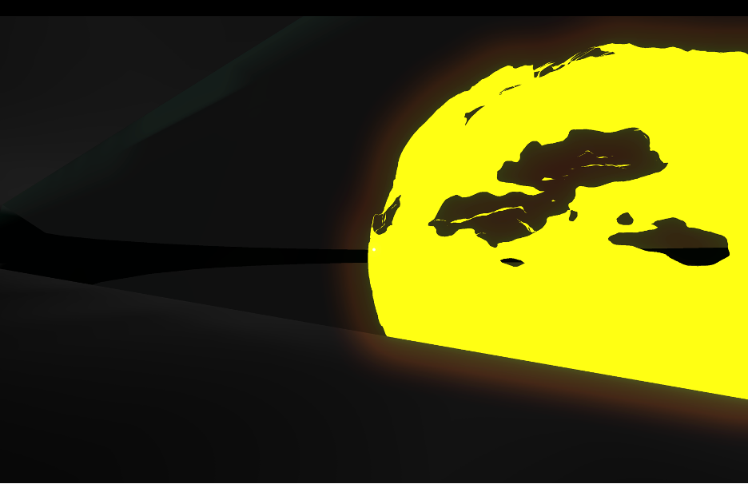

# Displace and Dissolve Shader

Author: Christian Caamano

Email: christian.d.caamano@vanderbilt.edu

VUNetID: caamancd

Class: CS 3981 - Game Engine Design

Instructor: Bobby Bodenheimer

#### Link to demo video: https://youtu.be/3YLTcpwk7uw

## Description & Functionality

Shader name: DisplaceDissolve

Description: This shader is a two-part Godot shader that consists of a vertex displace shader and a fragment dissolve shader. The vertex displace shader displaces the vertices by a particular amount and with a particular randomness factor, while the fragment dissolve shader produces a dissolve effect on the entire mesh, again with a particular adjustable amount.

## Testing

The shader was tested by setting up a demo scene of a Sun, onto which the shader material was placed. When the player pressed the left mouse button, the Sun mesh would displace and dissolve more and more until it dissappeared. At the same time, the displacement would increase, making the mesh look more flimsy.

## Compilation Instructions

Compilation instructions are for MacOS devices.

To run the demo, perform the following steps:
1. Clone this repository to your device.
2. Open Godot, click "Import" and open the folder in this repository named "CustomShaders".
3. Open this project in the editor and click play. Use WASD to move, spacebar to jump, mouse movement to look around, and left mouse button to dissolve the Sun. Toggle fullscreen on/off with F12.
4. If an error is encountered, please contact me via email.